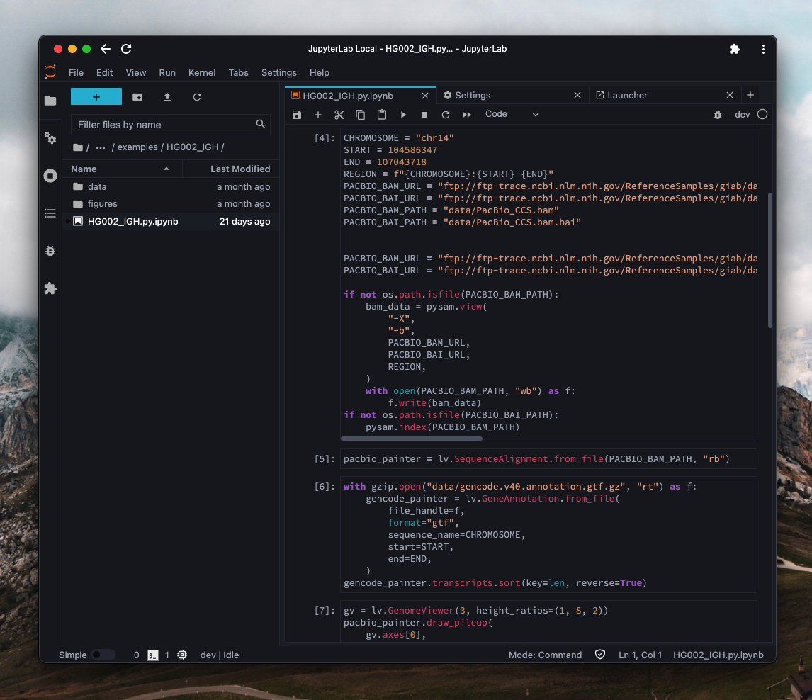

# JupyterLab Horizon Theme

[](https://github.com/jzhang-dev/jupyterlab-horizon-theme/actions/workflows/build.yml)

A [JupyterLab](https://jupyter.org/) theme based on [Horizon theme for Visual Studio Code](https://horizontheme.netlify.app/).



## Dependencies

- JupyterLab (⩾ v3.0)
- Node.js (⩾ v14.0)

## Installation

```bash
pip install git+https://github.com/jzhang-dev/jupyterlab-horizon-theme
```

This theme works best with Chromium based browsers.


## Credit

Thanks to [Jupyter Atom Dark Theme](https://github.com/BurglarBenson/Jupyter-Atom-Dark-Theme) for CSS elements styling.

